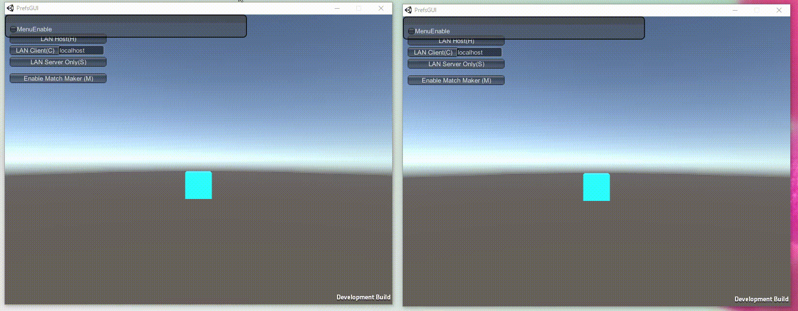
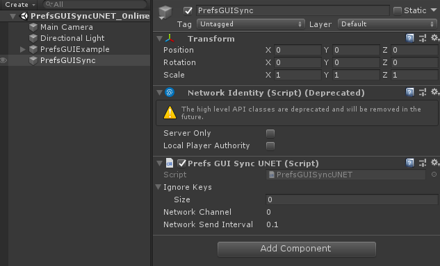
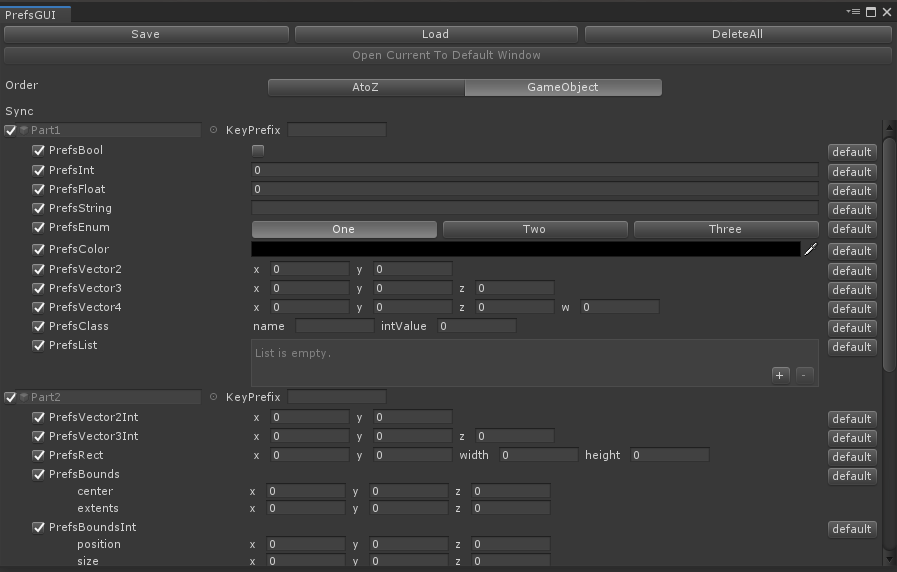

# PrefsGUISyncUNET
PrefsGUI subset for synchronization over the network




# Install

## Install dependencies

- **MultiPlayer HLAPI** from PackageManager
- [RapidGUI](https://github.com/fuqunaga/RapidGUI)
- [PrefsGUI](https://github.com/fuqunaga/PrefsGUI)

## Intall PrefsGUISyncUNET
Download a `.unitypackage` file from [Release page](https://github.com/fuqunaga/PrefsGUISyncUNET/releases).

or

**Using Pacakge Manager**  
Add following line to the `dependencies` section in the `Packages/manifest.json`.
```
"ga.fuquna.prefsguisyncunet": "https://github.com/fuqunaga/PrefsGUISyncUNET.git"
```

# Usage

Put **PrefsGUISyncUNET** game object to the scene.  
This inherits from `NetworkBehaivour`, so take steps to make it work(call `Spawn()` or put on the online scene).
<br>
All prefs are automatically synchronized between the server and client!

### Don’t want to sync some prefs
Disable sync toggle at the **EditorWindow**(See the section below).
or Set prefs's key to `PrefsGUISyncUNet.ignoreKeys` at the inspector.

# EditorWindow

- **Window -> PrefsGUI**
- You can set whether to synchronize with the sync toggle

# Reference
- **RapidGUI**  
https://github.com/fuqunaga/RapidGUI
<br>

- **PrefsGUI**  
https://github.com/fuqunaga/PrefsGUI
