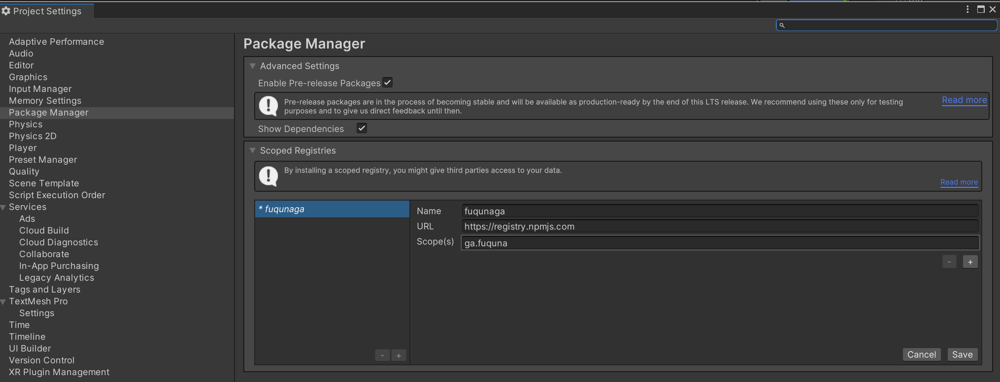
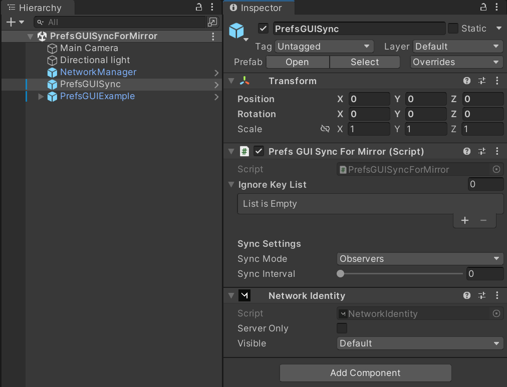
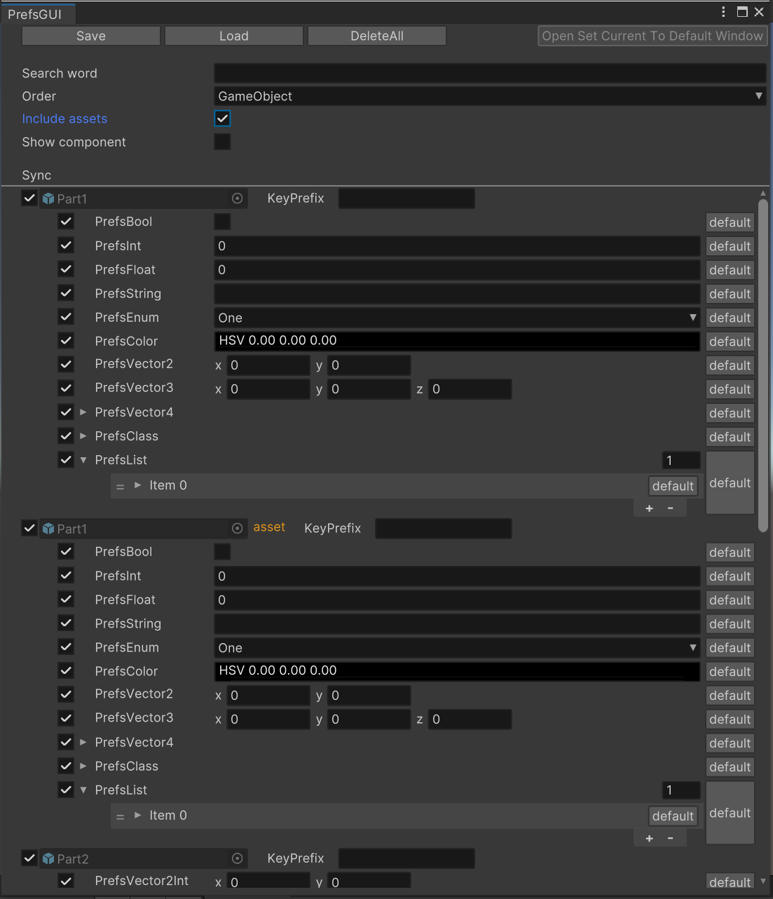

# PrefsGUISync For Mirror

Synchronization subset for [PrefsGUI](https://github.com/fuqunaga/PrefsGUI) over [Mirror](https://github.com/vis2k/Mirror).


# Installation
## Install Mirror
 - [Mirror via AssetStore](https://assetstore.unity.com/packages/tools/network/mirror-129321)


## Install package via scoped registry
**Edit > ProjectSettings... > Package Manager > Scoped Registries**

Enter the following and click the Save button.

```
"name": "fuqunaga",
"url": "https://registry.npmjs.com",
"scopes": [ "ga.fuquna" ]
```



**Window > Package Manager**

Select `MyRegistries` in `Packages:`


Select `PrefsGUISync For Mirror` and click the Install button


# Usage
  

Put `Packages/PrefsGUISync For Mirror/Runtime/PrefsGUISync.prefab` to the scene.  
PrefsGUISyncForMirror component inherits from [NetworkBehaivour](https://mirror-networking.gitbook.io/docs/components/networkbehaviour), so take steps to make it work(call `Spawn()` or put it on the online scene).  
  
Now all `prefs` are automatically synchronized between the server and client!

## Skip synchronization of specified `prefs`
Disable sync toggle at the **EditorWindow**(See the section below).  
or set `prefs`'s key to `PrefsGUISyncForMirror.ignoreKeyList`.

### EditorWindow

**Window > PrefsGUI**



You can set whether to synchronize with the sync toggle.

## Reduces the amount of data sent

### Sync only value changed `prefs`

* Default: *on*.
* `PrefsGUISyncForMirror` only sends `prefs` that have changed from their default values.
* This assumes that the `prefs` for the same key on the server and client share the same default values.
* If this flag is set to `false`, all `prefs` values will be sent.

### Divide spawn data

* Default: *off*.
* `PrefsGUISyncForMirror` sends all sync target `prefs` values when connecting to a client.
* If the data is too large, it may cause an error due to Mirror's capacity limit (approximately 300 kbytes).  
`NetworkConnection.Send: message of type Mirror.SpawnMessage with a size of [*] bytes is larger than the max allowed message size in one batch: 297421.`
* Setting `enableDivideSpawnData` to `true` will divide the data and send it in smaller packets.


### Consider using transport other than [KCP] such as [Telepathy]

* Mirror's capacity limitation is derived from [KCP Transport][KCP].
* If you encounter capacity limit errors, consider using a transport protocol other than KCP.
* For instance, Telepathy can handle larger amounts of data by configuring an appropriate buffer size.

[KCP]: https://mirror-networking.gitbook.io/docs/manual/transports/kcp-transport
[Telepathy]: https://mirror-networking.gitbook.io/docs/manual/transports/telepathy-transport

# Reference
- [UV Checker Map Maker](http://uvchecker.byvalle.com/)(CustomUVChecker_byValle_1K.png)
- [PrefsGUI](https://github.com/fuqunaga/PrefsGUI) - Accessors and GUIs for persistent preference values using a JSON file
