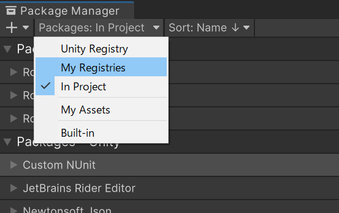

# PrefsGUISync For Mirror
Synchronization subset for [PrefsGUI](https://github.com/fuqunaga/PrefsGUI) over [Mirror](https://github.com/vis2k/Mirror)  
  
# Installation
## Install Mirror
 - [Mirror via AssetStore](https://assetstore.unity.com/packages/tools/network/mirror-129321)


## Install package via scoped registry
**Edit > ProjectSettings... > Package Manager > Scoped Registries**

Enter the following and click the Save button.

```
"name": "fuqunaga",
"url": "https://registry.npmjs.com",
"scopes": [ "ga.fuquna" ]
```


**Window > Package Manager**

Select `MyRegistries` in `Packages:`



Select `PrefsGUISync For Mirror` and click the Install button


# Usage
  

Put **PrefsGUISyncForMirror** GameObject to the scene.  
This inherits from [NetworkBehaivour](https://mirror-networking.gitbook.io/docs/components/networkbehaviour), so take steps to make it work(call `Spawn()` or put on the online scene).
<br>
Now all prefs are automatically synchronized between the server and client!

### ℹ️ No synchronization of specific prefs
Disable sync toggle at the **EditorWindow**(See the section below).<br>
or Set prefs's key to `PrefsGUISyncForMirror.ignoreKeys` at the inspector.

# EditorWindow

- **Window -> PrefsGUI**
- You can set whether to synchronize with the sync toggle

# Reference
[PrefsGUI](https://github.com/fuqunaga/PrefsGUI) - Accessors and GUIs for persistent preference values using a JSON file
